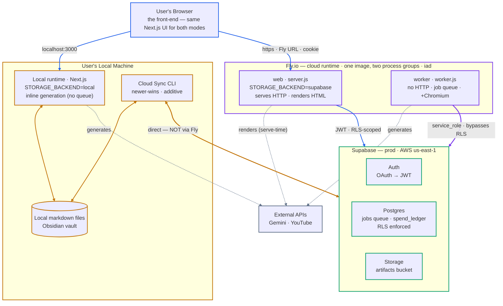

# YouTube Playlist Summaries

A Next.js web app that ingests a YouTube playlist, generates AI summaries and multi-dimensional ratings for each video using Gemini, and presents them in a sortable, filterable list. Summaries are saved as Markdown in a local output folder — ready to open directly in Obsidian — and can be opened as styled HTML docs that print or save to PDF from the browser.

## Features

- **Playlist ingestion** — paste a YouTube playlist URL, stream per-video progress via SSE
- **AI summaries** — Gemini generates structured summaries with five quality ratings (usefulness, depth, originality, recency, completeness)
- **Dig deeper** — on-demand, per-section elaboration with slide screenshots, grounded in the video clip
- **Sortable list** — sort by any rating dimension or overall score, ascending or descending
- **HTML docs** — open any summary as a styled, themeable HTML doc; print or save to PDF straight from the browser
- **Obsidian integration** — one-click `obsidian://open` URI to open notes in your vault
- **Archive** — move videos to an `archived/` subfolder; greyed-out rows stay visible when "Show Archive" is checked
- **Bilingual** — summaries are generated in the video's language (English or Korean)

## Tech stack

| Layer | Technology |
|---|---|
| Framework | Next.js 15 (App Router) + TypeScript |
| Styling | Tailwind CSS |
| AI | Gemini 2.5 Flash / Pro via `@google/generative-ai` |
| YouTube metadata | YouTube Data API v3 |
| Transcripts | `youtube-transcript` |
| HTML docs | `markdown-it` (print / save-to-PDF in browser) |
| Progress streaming | Server-Sent Events (SSE) |
| Testing | Jest + Testing Library + Playwright |

## Architecture

The **same Next.js app** runs in one of two interchangeable modes, chosen by the
`STORAGE_BACKEND` env var. Your **browser is the single front-end** for both — you just point
it at a different runtime:

- **Local mode** (`STORAGE_BACKEND=local`, the default) — the app runs **on your own
  machine** and stores summaries as **markdown files** (Obsidian-ready). Generation runs
  inline; there is no job queue. Browser → `localhost:3000`.
- **Cloud mode** (`STORAGE_BACKEND=supabase`) — the app runs on **Fly.io** and stores
  everything in **Supabase**. Work is split across a `web` process and a background `worker`.
  Browser → the Fly URL.

So your local machine is **not** a separate front-end — it plays the **same role Fly plays**,
just backed by the filesystem instead of Supabase. **Cloud Sync** is a CLI on your machine
that bridges the two stores (local files ↔ Supabase, newer-wins).



📐 **[Open the full rendered diagram →](https://kujinlee.github.io/youtube-playlist-summaries-cloud/architecture.html)** — larger, hand-laid-out version with a light/dark toggle.

**How to read it** — node border color marks the real system; line color marks the channel:

| Channel | Meaning |
|---|---|
| 🔵 **Browser → runtime** | The same UI, pointed at `localhost` (local) or the Fly URL (cloud, JWT + RLS) |
| 🟠 **Local / Sync** | Local runtime ↔ its files; Sync bridges files ↔ Supabase, **not via Fly**; newer-wins |
| 🟣 **`service_role`** | Worker path — bypasses RLS (writes for any user + the money ledger) |
| ⚪ **External calls** (dashed) | Whichever runtime is generating → Gemini &amp; YouTube |

Two seams carry the design:
- **Local vs cloud is one `STORAGE_BACKEND` switch** over one codebase — the same routes and
  UI resolve either the filesystem stores or the Supabase stores (`lib/storage/resolve.ts`).
- The **Postgres job queue exists only in cloud mode**: it decouples `web` (enqueues and
  returns instantly) from `worker` (claims jobs with a lease + spend reservation), so cloud
  generation survives a web restart. **Cloud Sync** is the only bridge between the two stores.

> There are actually **three environments**: the plain **local files** the local runtime uses,
> a **local Docker Supabase** for dev/testing cloud mode, and **prod Supabase** (shown above).
> The diagram's cloud side is the prod path; the local Docker one is the same shape pointed at
> `localhost`.

## Prerequisites

- Node.js 18+
- [Gemini API key](https://aistudio.google.com/app/apikey)
- [YouTube Data API v3 key](https://console.cloud.google.com/apis/library/youtube.googleapis.com)
- (Optional) [Obsidian](https://obsidian.md) with the output folder opened as a vault

## Setup

```bash
git clone https://github.com/kujinlee/youtube-playlist-summaries-official-plugins.git
cd youtube-playlist-summaries-official-plugins
npm install
cp .env.local.example .env.local
# Edit .env.local and fill in your API keys and output folder path
npm run dev
```

Open [http://localhost:3000](http://localhost:3000).

## Environment variables

Copy `.env.local.example` to `.env.local` and set:

| Variable | Description |
|---|---|
| `GEMINI_API_KEY` | Gemini API key |
| `GEMINI_SUMMARY_MODEL` | Model for summaries (default: `gemini-2.5-flash`) |
| `GEMINI_DEEPDIVE_MODEL` | Model for dig-deeper section analysis (default: `gemini-2.5-pro`) |
| `YOUTUBE_API_KEY` | YouTube Data API v3 key |
| `OUTPUT_FOLDER` | Absolute (or relative) path to the output folder |

The output folder is created automatically on first ingest. If you use it as an Obsidian vault, set `OUTPUT_FOLDER` to the vault's absolute path.

## Usage

1. Paste a YouTube playlist URL into the **Playlist URL** field
2. Confirm the **Output folder** path
3. Click **Fetch & Summarize** — a progress bar streams per-video status
4. When done, the video list appears sorted by name
5. Click **☰** on any row to open the per-video menu:
   - **Open in Obsidian** — opens the summary note in Obsidian
   - **Summary doc** — opens the summary as a styled HTML doc (print / save-to-PDF in the browser); dig into any section on demand
   - **Archive / Unarchive** — moves files to/from `archived/` subfolder

## Output folder layout

```
output-folder/
├── playlist-index.json       ← metadata index
├── {videoId}.md              ← summary (Markdown)
├── {videoId}-dig-deeper.md   ← dig-deeper companion (accumulates dug sections)
├── htmls/                    ← cached HTML docs (print / save-to-PDF in browser)
└── archived/
    └── ...                   ← archived video files
```

## Testing

```bash
npm test              # Jest unit + component tests (~224 tests, ~17s)
npm run test:e2e      # Playwright E2E tests (~9 tests, ~7s, requires dev server)
```

E2E tests mock all API routes via Playwright's `page.route()` — no real API keys needed. See `docs/ADR.md` for the rationale behind the three-tier test strategy.

## Project structure

```
app/
  page.tsx                        ← main page
  api/
    videos/route.ts               ← GET video list
    ingest/route.ts               ← POST start ingestion
    ingest/stream/route.ts        ← GET SSE progress stream
    videos/[id]/archive/route.ts  ← POST archive/unarchive
    settings/route.ts             ← GET/POST output folder setting
components/
  Header.tsx                      ← URL/folder inputs + submit
  SortBar.tsx                     ← column sort controls
  VideoList.tsx                   ← list + archive filter
  VideoRow.tsx / VideoMenu.tsx    ← per-video row and action menu
lib/
  gemini.ts                       ← all Gemini API calls
  youtube.ts                      ← YouTube Data API + transcripts
  pipeline.ts                     ← ingestion orchestration
  index-store.ts                  ← read/write playlist-index.json
  archive.ts                      ← file move logic
types/index.ts                    ← shared TypeScript types + Zod schemas
docs/
  design-spec.md                  ← full feature specification
  ADR.md                          ← architecture decision records
  available-skills.md             ← all Claude Code skills/agents/commands with trigger types
```

## Development (Claude Code)

This project is built with Claude Code using a gate-based workflow (brainstorm → spec → plan → TDD → review).

| Doc | Purpose |
|---|---|
| [`docs/available-skills.md`](docs/available-skills.md) | All Claude Code skills, agents, and commands available in this project — invoke strings, trigger type (`auto + /slash`, `/command`, `agent`), and descriptions |
| [`docs/dev-process.md`](docs/dev-process.md) | **The spine** — phases, gates, who decides what. Deliberately short and under a CI-enforced line budget; the three files below hold the detail |
| [`docs/process-checklists.md`](docs/process-checklists.md) | Lists you work *through*: per-task checklist, post-plan gate, TDD policy, required spec contents |
| [`docs/review-method.md`](docs/review-method.md) | How a review round is run: adversarial review, convergence, and the between-rounds classification passes (P/I/H rules, SHAPE/SEQUENCE guards) |
| [`docs/process-rationale.md`](docs/process-rationale.md) | Why each rule exists, with the measured incident behind it — read when a rule looks arbitrary |
| [`docs/plugins.md`](docs/plugins.md) | Required plugins, skill conflict resolution, and cleanup guidance |
| [`docs/adr/`](docs/adr/README.md) | Architecture Decision Records — decisions a future reader would otherwise reverse by accident (e.g. why there is no `ffmpeg` in the Docker image) |
| [`docs/roadmap-to-launch.md`](docs/roadmap-to-launch.md) | Milestones and next actions; reconciled against `git log`, not trusted as-is |
| [`docs/backlog.md`](docs/backlog.md) | Triaged enhancement backlog |
| [`docs/architecture.html`](https://kujinlee.github.io/youtube-playlist-summaries-cloud/architecture.html) | Standalone architecture diagram (rendered) — richer version of the Mermaid diagram above, with a light/dark toggle. Source: [`docs/architecture.html`](docs/architecture.html) |

To regenerate the skills reference after installing or updating plugins, say **"sync docs"** or run `/sync-docs` — the `sync-docs` skill handles it. Or run directly:

```bash
python3 scripts/regen-skills-doc.py
```

### CI

Every pull request runs [`.github/workflows/ci.yml`](.github/workflows/ci.yml) on Node 22 (matching the
Dockerfile): `tsc --noEmit`, the unit/component suite, the `service_role` confinement guard, and the
documentation-integrity check. Integration tests need a live Supabase stack and E2E needs Playwright
browsers, so both stay local — run them before asking for a merge.

### Maintenance scripts

| Script | Purpose |
|---|---|
| `python3 scripts/check-docs.py` | Documentation integrity — ADR index drift, dangling ADR references, broken links |
| `python3 scripts/skill-usage-audit.py` | Which installed Claude Code skills are actually used, across all sessions |
| `./scripts/publish-arch-page.sh` | Publish `docs/architecture.html` to GitHub Pages |
| `python3 scripts/regen-skills-doc.py` | Regenerate `docs/available-skills.md` |
