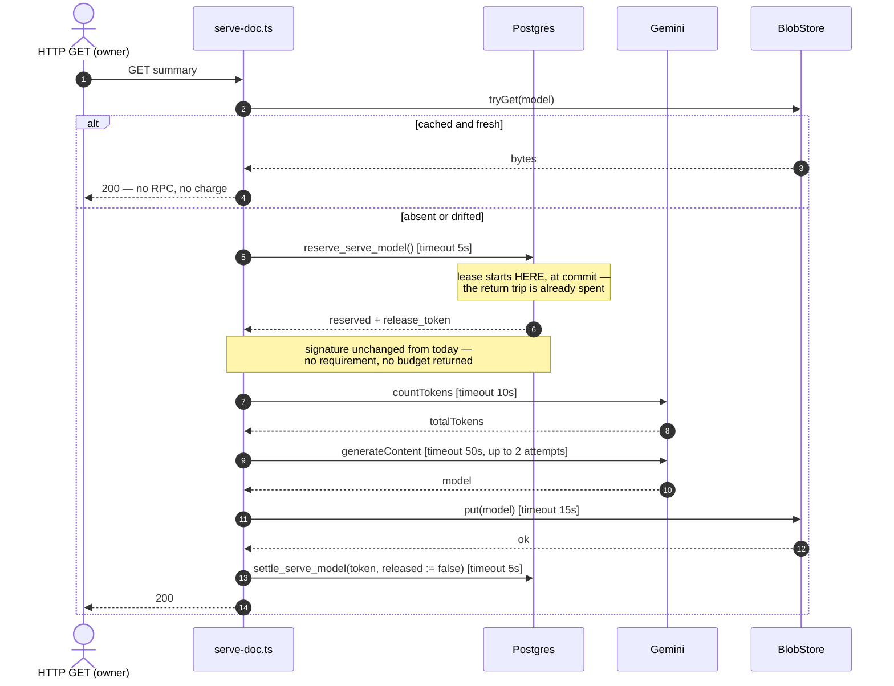
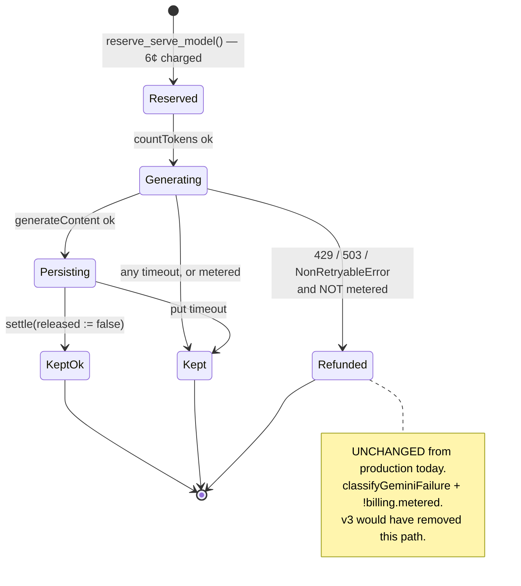

# Bounding the Serve Path — Design Spec

**Status:** **v5** — round-5 findings applied to the v4 redesign. v1–v3 are superseded, not amended.
**Round 6 is required** — the gate is a full round with no new Blocking/High, which has not happened.
**Task:** #46 · **Prod issue:** yes — the unbounded awaits are live today

**Review trail**

| Round | Doc | Result |
|---|---|---|
| 1 | [codex r1](../../reviews/spec-serve-deadline-codex-r1.md) | NOT CONVERGED — 6 findings, all accepted |
| 2 | [codex r2](../../reviews/spec-serve-deadline-codex-r2.md) | NOT CONVERGED — 8 findings, **6 caused by round 1's fixes** |
| 3 | [codex r3](../../reviews/spec-serve-deadline-codex-r3.md) | NOT CONVERGED — 7 findings, **7 caused by round 2's fixes** |
| 4 | [design review](../../reviews/spec-serve-deadline-design-review-r4.md) | **VERDICT: REDESIGN** |
| 5 | [codex v4 r5](../../reviews/spec-serve-deadline-codex-v4-r5.md) | NOT CONVERGED — 7 findings on the redesign, **none a regression from a prior fix** |

Rounds 2 and 3 tripped the escalation rule in [`review-method.md:45-47`](../../review-method.md) —
*findings caused by the previous round's fixes in two consecutive rounds → stop fixing, redesign.*
21 of 21 findings were confirmed against the code. **The defects were real and the shape was wrong**;
those are not in tension, and that is exactly what the rule exists to detect.

**Round 5 is the first round that did not re-trigger it.** Its findings are term-level — omitted
budget terms, an overstated seam, an understated risk — and every one is repaired *inside* the shape
without adding a mechanism. §2.1's table is unchanged from v4. That is what a converging design looks
like, and it is the distinction the escalation rule exists to draw.

---

## 0. The idea in plain terms

**The serve path can take longer than the lease it holds.**

A user requests a magazine rendering. The app takes a 180-second lease, is charged 6¢, calls Gemini,
writes the result, settles. Two of those calls have no time bound at all, and the bounded ones add up
to more than 180 seconds. When the lease expires under a still-running request,
`reserve_serve_model`'s reclaim clause admits a **second paid producer** — two charges, one document.

**The fix: make the work provably shorter than the lease, and stop the lease from being configured
below the work.** No coordination, because there is nothing to coordinate with — §2.2.

---

## 1. What is measured, not asserted

Quoted from the tree at `1a7c076`. Verified in review rounds 1–2 and unchanged by the redesign.

### 1.1 Two unbounded awaits, on a user-facing GET

`lib/gemini.ts:72-88` — `assertMagazineInputWithinCap` takes **no signal parameter**, and its
`countTokens` at `:82-84` is a bare await. `lib/html-doc/model-store.ts:51` — `blobStore.put` is the
same shape. Both run inside the lease-holding section of `lib/html-doc/serve-doc.ts` (`:112`, `:117`),
reached from a user-facing HTTP GET.

### 1.2 The bounded part already overruns the lease

| source | value |
|---|---|
| `supabase/migrations/0012_serve_model_charge.sql:22` | `lease_ttl_seconds int not null default 180` |
| `lib/gemini.ts:94` | `REQUEST_TIMEOUT_MS = 60_000`, applied per attempt at `:259` |
| `lib/gemini-cost.ts:22` | `GENERATE_JSON_RETRIES = 2` → 3 attempts (`:256`) |
| `lib/gemini.ts:267` | backoff `400 * 2**attempt` → 400 ms + 800 ms |

**181,200 ms against a 180,000 ms lease.** Two of those numbers are TypeScript constants and one is a
Postgres column. Nothing in the repo relates them, so nothing could have caught the product.

### 1.3 A refund does not undo an attempt

`supabase/migrations/0020_reservation_release.sql:269-298` — `settle_serve_model` adjusts the ledgers
and **never touches `attempt_count`**, which is bounded by `max_serve_attempts` (default 5,
`0012:21`). A reserve-then-abort returns the money and burns the attempt; five brick the document for
the UTC day while the ledger balances.

---

## 2. Coherence — filled in BEFORE review this time

Required by [`process-checklists.md:171-196`](../../process-checklists.md) for any spec that adds a
mechanism. **It was skipped for v1–v3, and skipping it is the direct cause of the three wasted
rounds** — the duplicate below was visible from the first draft for the cost of writing the table.

### 2.1 Concern → mechanism

| Concern | Mechanism | Evidence |
|---|---|---|
| Prevent a second paid producer for one `(owner, doc_key, day)` | the **existing** `serve_model_charge` lease — **unchanged by this spec** | `0012:7-13`, `0020:217-235` |
| Bound each external call | a per-call timeout | §3.1 |
| Guarantee the bounded work fits inside any configured lease | a **CHECK constraint** on `lease_ttl_seconds` | §3.3 |
| Decide whether a failed generation is refundable | the **existing** `classifyGeminiFailure` + `billing.metered` — **unchanged** | `gemini-failure.ts:76-86`, `serve-doc.ts:130-132` |

One mechanism per concern, one concern per mechanism.

**What v3 had here, for contrast:** three mechanisms for "the work fits the lease", three for "refund
correctness", two for "the declaration is credible". The design review's table
(`design-review-r4.md:53-54`) put the duplicate in two adjacent rows.

### 2.2 What already does this?

**Which existing mechanism serves "prevent a second paid producer", and why is it insufficient?**

`serve_model_charge` serves it, and it is **not** insufficient. `[VERIFIED: 0012:7-13]` one row per
`(owner_id, doc_key, day)`; `[VERIFIED: 0020:217-223]` reclaim only after `lease_expires_at < now()`;
`[VERIFIED: 0020:226-235]` a live lease returns `in_flight` so no second producer starts.

`docs/adr/0007-artifacts-are-an-append-only-log.md:129` already names it *"a third coordination
vocabulary"* — flagged as a smell one week before this spec. v3 proposed a **fourth**, for the concern
the third owns.

The lease fails in exactly one way: **when the work outlasts it.** That is not a coordination gap. It
is an inequality, and §3 fixes the inequality.

**Who are the writers?** One class. `[VERIFIED: design-review-r4.md:31-47]` HTML
(`app/api/html/[id]/route.ts`) and PDF (`app/api/pdf/[id]/route.ts`) are *entrypoints* through the same
`serve-summary-core.ts:105`, carrying the same `auth.uid()`. Local generation never reserves
(`generate.ts:40-50`); cloud sync copies bytes and does not produce (`sync-run.ts:437-465`).

**With one writer class there is nothing to negotiate**, which is why v3's cross-authority protocol had
no counterparty and spent six mechanisms keeping two numbers in agreement.

---

## 3. Design

### 3.0 Why there is no runtime deadline — and what that costs

v3 needed a `Deadline` object, a monotonic `t0`, a DB→app budget channel and unit conversions because
the budget was **dynamic** — discovered per request from the database.

It does not need to be. If every call carries a fixed timeout, the worst case is a **static sum
computed at build time**. A constant cannot be stale, cannot be measured against the wrong clock, and
cannot arrive late. Transport latency, seconds-vs-milliseconds, the viability check and the floor
column were all defects in machinery that existed *only* to move that number around; deleting the
machinery deletes the class.

**What is genuinely given up (round-5 Low).** A runtime deadline bounds *unmodelled* overhead — work
nobody thought to put in the sum. A static sum does not: **an omission stays invisible until
production.** Round 5 proved the point by finding two omissions (the reserve and settle RPCs) in v4's
sum.

The compensating control is §3.2's split: every term in the sum is now enforced by an actual timeout,
and everything unenforceable is quarantined into one named margin. A term that is merely *added* is
the failure mode — v4 had one (`SETTLE_SLACK_MS`) and it was a Blocking.

### 3.1 Bound every call — including the Supabase ones

**v4 claimed "bound each external call" while leaving both RPCs unbounded (round-5 M2). They are
external calls; they are bounded here.**

| call | today | v5 |
|---|---|---|
| `reserve_serve_model` RPC (`serve-doc.ts:74`) | bare await | `RESERVE_RPC_TIMEOUT_MS` |
| `countTokens` (`gemini.ts:82`) | bare await | `COUNT_TOKENS_TIMEOUT_MS` |
| `generateContent` (`gemini.ts:259`) | `REQUEST_TIMEOUT_MS` (60 s) | `SERVE_ATTEMPT_TIMEOUT_MS` (50 s), serve path only |
| attempts (`gemini.ts:256`) | 3 | **2**, serve path only |
| `blobStore.put` (`model-store.ts:51`) | bare await | `PUT_TIMEOUT_MS`, caller-side race |
| `settle_serve_model` RPC (`serve-doc.ts:126`, `:133`) | bare await | `SETTLE_RPC_TIMEOUT_MS` |

**The Supabase client supports this.** `[VERIFIED: node_modules/@supabase/postgrest-js/dist/index.d.mts]`
exposes `abortSignal(signal: AbortSignal): this`, and its own documentation example is
`abortSignal(AbortSignal.timeout(1000))`. `[VERIFIED: lib/supabase/server.ts:10-20]` sets no timeout
today, which is why both RPCs are currently unbounded.

**What a bounded RPC does and does not do.**

- *Reserve:* a timeout means we stop waiting. It does **not** roll back the transaction — the lease
  may have been granted and charged. So on a reserve timeout the app **abandons without producing**:
  no Gemini call, no write. The charge and the `attempt_count` are lost (§1.3), and the lease blocks
  other producers until it expires — the *safe* direction, since single-flight is preserved and no
  second producer exists. Logged loudly; a recurring reserve timeout is an infrastructure alarm.
- *Settle:* a timeout means we stop waiting; the statement may still commit. It is **not** a
  cancellation, and the spec must not imply one. Its purpose is solely to stop a hung settle from
  running past the lease.

**The Gemini SDK supports the preflight bound.** `[VERIFIED: generative-ai.d.ts:778]`
`countTokens(request, requestOptions?: SingleRequestOptions)` and `[VERIFIED: :1297-1306]`
`SingleRequestOptions extends RequestOptions` with `signal?: AbortSignal`.

**The retry/timeout reduction needs a real option — v4's "one-argument change" was wrong (round-5
H1).** `generateJson` takes `retries` `[VERIFIED: gemini.ts:251]`, but `generateMagazineModel` has no
such parameter `[VERIFIED: gemini.ts:499-505]`, and `html-doc/generate.ts:40` calls it on the **local**
path. Changing `gemini.ts:549` from `undefined` to `1` would silently reduce local generation's
retries too.

So: `generateMagazineModel` gains `opts.serve?: { retries: number; attemptTimeoutMs: number }`, and
`generateJson` gains an optional `timeoutMs` defaulting to `REQUEST_TIMEOUT_MS`. Absent the option,
every existing caller keeps `GENERATE_JSON_RETRIES` and 60 s — asserted by test (§5).

### 3.2 The worst case: enforced terms, and one quarantined margin

```
BOUNDED — every term is a timeout the code actually applies
  RESERVE_RPC_TIMEOUT_MS                       5_000
  COUNT_TOKENS_TIMEOUT_MS                     10_000
  SERVE_ATTEMPTS * SERVE_ATTEMPT_TIMEOUT_MS  100_000   (2 * 50_000)
  SERVE_BACKOFF_TOTAL_MS                         400   (one gap between two attempts)
  PUT_TIMEOUT_MS                              15_000
  SETTLE_RPC_TIMEOUT_MS                        5_000
                                             -------
  SERVE_BOUNDED_MS                           135_400

UNBOUNDABLE — cannot be timed out, so it is margin, not budget
  SERVE_MARGIN_MS                             20_000

  SERVE_FLOOR_MS      = 135_400 + 20_000  =  155_400
  SERVE_FLOOR_SECONDS = ceil(155_400/1000) =     156
```

**The split is the point.** `SERVE_BOUNDED_MS` is a promise the code keeps: each term corresponds to a
timeout that fires. `SERVE_MARGIN_MS` is an *assumption* covering what no timeout can bound — JS
scheduling, GC pauses, `JSON.parse`, Zod validation, `mdHash`, prompt construction, client
construction, TLS setup. It is labelled an assumption everywhere it appears.

v4 blurred these into one addition and shipped `SETTLE_SLACK_MS` — a guess with a budget's name — which
round 5 made a Blocking. **A term that is only added is not a bound.**

**The floor is not the worst case (round-5 M1).** v4 set the floor equal to its sum, leaving 600 ms at
the legal minimum: any operator choosing the floor converted millisecond variance into duplicate paid
producers. Here the floor *includes* the 20 s margin by construction, so the minimum legal
configuration still carries 20 s of unmodelled-overhead headroom.

| constant | status | basis, and what would revise it |
|---|---|---|
| `REQUEST_TIMEOUT_MS` | **exists** — `gemini.ts:94` | unchanged; still 60 s off the serve path |
| `SERVE_ATTEMPT_TIMEOUT_MS = 50_000` | **new** | 60 s does not fit two attempts plus the enforced terms. Revise with observed magazine latency |
| `SERVE_ATTEMPTS = 2` | **new** | §3.5 |
| `COUNT_TOKENS_TIMEOUT_MS = 10_000` | **new, provisional** | never measured. Revise from p99 once timeout logs exist |
| `PUT_TIMEOUT_MS = 15_000` | **new, provisional** | one small-JSON upload. Revise from p99 |
| `RESERVE_RPC_TIMEOUT_MS = 5_000` | **new, provisional** | one round trip to Postgres. Revise from p99 |
| `SETTLE_RPC_TIMEOUT_MS = 5_000` | **new, provisional** | as above |
| `SERVE_MARGIN_MS = 20_000` | **new, an assumption** | ~13 % of the bounded budget for unmodelled local work. **Revise upward on any observed lease expiry that the bounded terms cannot explain** |

All live in `lib/serve-budget.ts`, so the sum has one home and the migration literal has one thing to
be pinned against.

### 3.3 The constraint is the whole agreement

```sql
-- migration 0024
alter table guardrail_config drop constraint <lease_ttl_check>;   -- read the generated name first
alter table guardrail_config add  constraint guardrail_config_lease_ttl_covers_serve
  check (lease_ttl_seconds >= 156);                               -- = SERVE_FLOOR_SECONDS
```

Today `[VERIFIED: 0012:22]` `check (lease_ttl_seconds >= 1)` — a one-second lease is legal, which is
exactly why v3 believed adequacy could only be discovered per request. Raise the floor and the
inequality holds **once, at configuration time, for every request forever**.

`[unverified]` the existing constraint's generated name — it is inline and unnamed in `0012:22`. Read
it from `pg_constraint` during implementation rather than guessing.

**What the constraint can and cannot prove (round-5 B1).** v4 claimed the floor established the
inequality. It did not, because the reserve RPC's *response transit* was omitted from the sum and is
unbounded: the lease begins when the DB commits, and a stalled response can exceed **any** floor.

The floor is sound **only because §3.1 bounds the reserve call.** With that bound, the time between
lease start and the app's first action is at most `RESERVE_RPC_TIMEOUT_MS`, which is a term in the sum.
The constraint and the client timeout are one mechanism in two places, not two mechanisms: **neither
is sufficient alone, and the spec is wrong wherever it implies the constraint alone suffices.**

### 3.4 What is deliberately NOT changed

| | why |
|---|---|
| `reserve_serve_model` / `settle_serve_model` signatures | nothing is declared; the constraint plus the client timeouts hold the invariant |
| `BillingLatch` | `attempted` existed only to classify deadline aborts, which are no longer a designed path |
| the refund rule | **v3 silently revoked the 429/503 refund** (round-3 B1). `classifyGeminiFailure` + `!metered` stays exactly as shipped |
| `guardrail_config` columns | no floor column, no drift gate to defend it |
| `BlobStore.put`'s signature | a timeout is caller-side; the three adapters are untouched |

### 3.5 The two real trades

**Attempts 3 → 2, and 60 s → 50 s per attempt, on the serve path only.** The current third attempt is
what pushes the worst case past the lease, and an overrun costs a second 6¢ charge plus an
`attempt_count` burn — worse for the same user than a clean failure they can retry.
`max_serve_attempts` (default 5) still governs retries across requests. Local generation is unaffected
(§3.1).

**A late `put` can overwrite a newer model (round-5 H2).** v4 called an abandoned upload "benign". That
is true against nothing, and false against a **later producer**: A's `put` times out, B reserves and
writes a fresh model, then A's original upload completes with `upsert:true` and overwrites B.

The caller-side race cancels our *wait*, never the upload — the same vendor asymmetry as an aborted
Gemini call, one layer out.

Traced, the consequence is bounded but real: `readFreshMagazineModel` compares `sourceSections` and
`sourceMdHash`, so a regressed envelope reads as **drifted** and regenerates. The cost is another
6¢ generation, not permanent corruption or a wrong document. Requires A to time out, B to write in the
interval, *and* the source MD to have changed between them.

**Not eliminated.** A conditional write would fix it, and `put` is `upload(upsert:true)` with no
precondition support. Logged with elapsed time so a `PUT_TIMEOUT_MS` set too low is diagnosable rather
than inferred.

---

### 3.6 Diagrams

### Budget: the worst case against the lease

```mermaid
gantt
    title Serve budget — 135.4s enforced + 20s margin = floor 156s, inside a 180s lease
    dateFormat X
    axisFormat %ss

    section Lease
    lease_ttl_seconds = 180 (CHECK floor 156)   :active, 0, 180

    section Enforced by a timeout
    reserve RPC (5s)                :a0, 0, 5
    countTokens (10s)               :a1, 5, 15
    generateContent attempt 1 (50s) :a2, 15, 65
    backoff (0.4s)                  :a3, 65, 65
    generateContent attempt 2 (50s) :a4, 65, 115
    blobStore.put (15s)             :a5, 115, 130
    settle RPC (5s)                 :a6, 130, 135

    section Assumption, not a bound
    SERVE_MARGIN_MS (20s)           :crit, 135, 155

    section Spare
    headroom at the default (24.6s) :done, 155, 180
```



The whole design is this picture, and the section labels carry the round-5 lesson: everything above
the margin is a promise the code keeps, the margin is an **assumption** about work no timeout can
bound, and §3.3 makes the total true for every configuration the database will accept.

v4's version of this chart had no `reserve RPC` bar, no `settle RPC` bar, and a 600 ms gap between the
work and the lease. Two of those omissions were Blocking findings — **the diagram would have shown
them if it had been drawn from the await list rather than from the prose.**

### The serve path



No `alt` blocks before the work begins. That absence is the redesign.

The `lease starts HERE` note is round-5 B1 in one line: the lease begins when the DB commits, so the
response's return trip is already spent when the app receives it. That is why the reserve call carries
a timeout — without it the term is unbounded, and **no CHECK floor can prove an inequality containing
an unbounded term.**

### Money: which failures refund



---

---

## 4. Error handling

**Nothing about the money rule changes.** `classifyGeminiFailure(err, signal)`
`[VERIFIED: gemini-failure.ts:76-86]` plus `!billing.metered` at `serve-doc.ts:130-132` decides refunds
exactly as shipped: 429/503 and `NonRetryableError` refund when not metered; everything else keeps.

A **timeout** is an `AbortError`: `ourSignal?.aborted` is false (the timeout aborts a different
signal), the cause chain matches neither `NonRetryableError` nor `GeminiHttpError`, so it falls to
`'keep'` at `:85`. The charge is kept, which is correct — `[VERIFIED: generative-ai.d.ts:1302-1304]`

> NOTE: AbortSignal is a client-only operation. Using it to cancel an operation will not cancel the
> request in the service. **You will still be charged usage for any applicable operations.**

Cancellation is **not a cost-control mechanism**. It protects the lease, never the bill.

**Reserve timeout** → abandon without producing (§3.1), surface `busy` (transient, retryable — the same
meaning it already carries at `serve-doc.ts:84`), and log. No Gemini call has been made and no
`release_token` is in hand, so there is nothing to settle.

**Settle timeout** → the work is done and the model is written; only our acknowledgement was lost. Log
and return the successful result. The reservation clears when the statement commits, or the lease
expires and the row is reclaimed — the existing behaviour for any lost settle.

---

## 5. Testing

**The sum, term by term.** `SERVE_BOUNDED_MS` equals the sum of its six terms; `SERVE_FLOOR_MS` equals
`SERVE_BOUNDED_MS + SERVE_MARGIN_MS`; `SERVE_FLOOR_SECONDS <= 180`, the shipped `lease_ttl_seconds`
default. Write this first and watch it fail against today's constants (181,200 > 180,000) — the
assertion that would have caught §1.2.

**Every bounded term is actually bounded.** One test per row of §3.1's table: reserve, `countTokens`,
`generateContent`, `put`, settle each abort at their timeout rather than hanging. **This is the test
that distinguishes v5 from v4** — v4's `SETTLE_SLACK_MS` would have passed a sum test and failed this
one. Assert the error *identity*, not that "something failed".

**The margin is not a bound, and the tests must not imply it is.** There is no test for
`SERVE_MARGIN_MS`; it is an assumption. What *is* asserted is that it appears only in `SERVE_FLOOR_MS`
and never as a timeout argument.

**Serve-only-ness (round-5 H1).** `generateMagazineModel` **without** `opts.serve` uses
`GENERATE_JSON_RETRIES` and `REQUEST_TIMEOUT_MS`; **with** it, 2 attempts at 50 s. Assert the local
path (`html-doc/generate.ts:40`) is unchanged — the regression this test exists to prevent is silent.

**The attempt count.** At most 2 `generateContent` calls on the serve path. Mutate the option away and
this must go red, or it asserts nothing.

**The refund rule is unchanged, so pin it.** 429 while not metered still refunds (`p_released := true`).
v3 would have broken this and nothing would have noticed. This test exists to make that class of
regression impossible, not because v5 changes anything.

**Late-`put` overwrite (round-5 H2).** A's timed-out upload landing after B's write produces a *drifted*
envelope that `readFreshMagazineModel` rejects, triggering regeneration rather than serving stale
content. Assert the drift detection fires — the claim in §3.5 that the damage is bounded to one extra
generation is load-bearing, and untested it is just a hope.

**Schema.** `scripts/check-schema-gates.sh`, plus a mutation on the constraint: lower the floor back to
1 and an integration test inserting `lease_ttl_seconds = 30` must stop failing. An unmutated guard is
undemonstrated.

**Anti-drift.** The migration's literal `156` must equal `SERVE_FLOOR_SECONDS` from
`lib/serve-budget.ts`. A migration literal cannot import a TypeScript constant, so this assertion is
the only thing between a tuned constant and a floor that no longer covers the work.

---
## 6. Deploy ordering

The constraint must not be applied while a deployed installation has `lease_ttl_seconds < 156`, or the
migration fails on a live database.

1. Read the current value in each environment. `[unverified]` — production's configured
   `lease_ttl_seconds` has not been checked against the live database in this session, and the memory
   note on out-of-band changes says the doc is not evidence. **Check before applying.**
2. If any environment is below 156, raise it first, in its own step.
3. Then apply 0024, then deploy the app.

App and schema are **not** coupled this time: the app change is safe with or without the constraint,
and the constraint is safe with or without the app. That independence is a direct consequence of
deleting the protocol — v3 required function-before-app ordering plus a column-before-function
constraint within the migration.

---

## 7. The trail

### 7.1 Rounds 1–3: what was found, and why it was the wrong question

21 findings, all confirmed against the code. They are preserved in
`docs/reviews/spec-serve-deadline-codex-r{1,2,3}.md` and are worth reading as a record of how a wrong
shape emits real defects indefinitely.

The pattern, from [`review-method.md:40-43`](../../review-method.md): *adversarial review answers "is
this correct?", a local question, and a local question can always be answered yes by patching.* Three
rounds of correct answers to the local question.

Highlights worth carrying forward:

- **r3 B1 — v3 silently revoked the existing 429/503 refund.** A fix for a money finding introduced a
  money regression against deliberately-designed production behaviour. v4 changes nothing here (§3.4).
- **r2 B3 + r3 H3 — "`countTokens` is free" and "built from existing constants" were both unverified
  claims presented as facts.** §3.2 now labels every new constant as new.
- **r2 B2 — seconds versus milliseconds**, in a spec whose subject was numbers that don't agree.
- **The instrument that would have caught all of it** was the §2 coherence table, skipped before
  approval. It takes ten minutes and shows one concern with three mechanisms.

### 7.2 Round 4: the design review

`docs/reviews/spec-serve-deadline-design-review-r4.md` — **VERDICT: REDESIGN**, reached independently
from the same evidence: one concern with two mechanisms (`:53-54`), one writer class (`:31-47`),
ADR-0007 already naming `serve_model_charge` a third coordination vocabulary (`:17`).

It recommended shape (b) and named the one thing (b) gives up (`:80`) — that Postgres would not reject
an operator who lowers `lease_ttl_seconds` below the app's bound. **§3.3 closes that hole in one line**,
which the review did not propose. The verdict is adopted; its accepted loss is not.

### 7.3 Round 5: the redesign's first adversarial round

`docs/reviews/spec-serve-deadline-codex-v4-r5.md` — NOT CONVERGED, 7 findings, all confirmed.

| # | Finding | Disposition |
|---|---|---|
| B1 | the sum omits the reserve RPC wait, so the CHECK floor proves nothing | **Accepted** — §3.1 bounds the reserve call; §3.3 now states the floor is sound *only* with that bound |
| B2 | `SETTLE_SLACK_MS` is not an enforced bound but is treated as one | **Accepted** — §3.2's enforced/assumption split; settle is bounded |
| H1 | the retry reduction is not serve-path-only | **Accepted** — §3.1 adds an explicit option; v4's "one-argument change" claim was wrong |
| H2 | a late `put` can overwrite a **newer** model | **Accepted** — §3.5 states it, traces the bound (drift → regeneration), stops calling it benign |
| M1 | 600 ms margin at the floor is non-survivable | **Accepted** — the floor now *includes* a 20 s margin by construction |
| M2 | "bound every call" was false for the Supabase calls | **Accepted** — §3.1 |
| Low | v4 lost v3's live remaining-time guard without saying so | **Accepted** — §3.0 |

**None of these is a regression from a previous round's fix**, which is the first time that has been
true in this spec's history. The escalation rule (`review-method.md:45-47`) counts *"findings caused by
the previous round's fixes"* — round 5's are first-pass findings on a new artifact, and §2.1's
concern→mechanism table is byte-identical to v4's. The design absorbed seven findings without growing
a mechanism.

**The two Blocking findings share one root, and it is worth naming.** v4 wrote a budget from the
*prose* — the calls it had been thinking about — rather than from the **await list**. Enumerating every
`await` between the charge and the settle, which round 5's audit did mechanically, found two the prose
never mentioned. A static budget is exactly as good as the enumeration behind it, and the enumeration
is a mechanical act that was skipped.

**What would have caught it earlier:** drawing the Gantt chart from the await list rather than from the
design's narrative. The chart in §3.6 now has a bar per enforced term, so a missing term is a visible
gap rather than a silent omission in an addition.

## 8. Out of scope

The BlobStore **object-age** seam remains task #44. Cloud-sync, generation and dig paths are untouched:
this spec changes the serve path's timeouts and one CHECK constraint.
