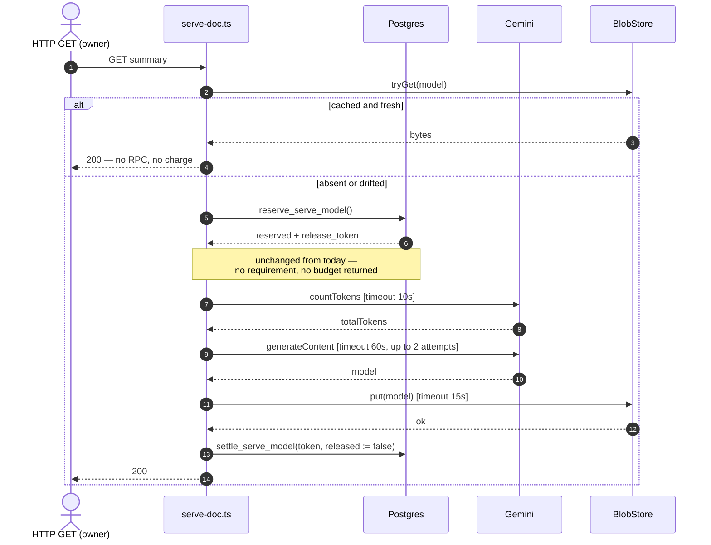
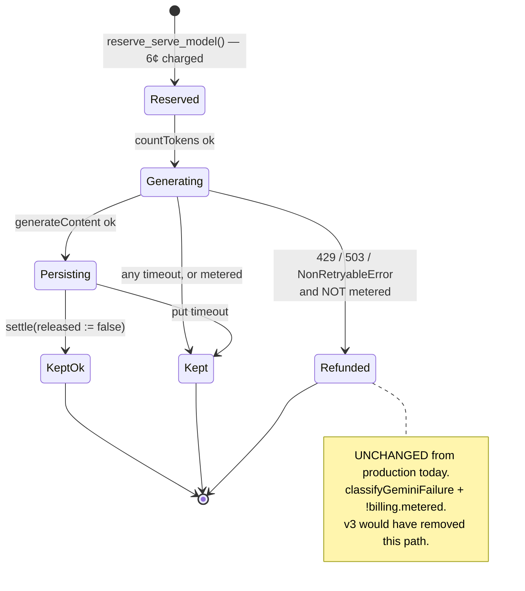

# Bounding the Serve Path — Design Spec

**Status:** **v4 — REDESIGN.** v1–v3 are superseded, not amended. §3–§5 are new; §1 (the measurements)
and §7 (the trail) are retained because they are what the redesign was bought with.
**Task:** #46 · **Prod issue:** yes — the unbounded awaits are live today

**Review trail**

| Round | Doc | Result |
|---|---|---|
| 1 | [codex r1](../../reviews/spec-serve-deadline-codex-r1.md) | NOT CONVERGED — 6 findings, all accepted |
| 2 | [codex r2](../../reviews/spec-serve-deadline-codex-r2.md) | NOT CONVERGED — 8 findings, **6 caused by round 1's fixes** |
| 3 | [codex r3](../../reviews/spec-serve-deadline-codex-r3.md) | NOT CONVERGED — 7 findings, **7 caused by round 2's fixes** |
| 4 | [design review](../../reviews/spec-serve-deadline-design-review-r4.md) | **VERDICT: REDESIGN** |

Rounds 2 and 3 tripped the escalation rule in [`review-method.md:45-47`](../../review-method.md) —
*findings caused by the previous round's fixes in two consecutive rounds → stop fixing, redesign.*
21 of 21 findings were confirmed against the code. **The defects were real and the shape was wrong**;
those are not in tension, and that is exactly what the rule exists to detect.

---

## 0. The idea in plain terms

**The serve path can take longer than the lease it holds.**

A user requests a magazine rendering. The app takes a 180-second lease, is charged 6¢, calls Gemini,
writes the result, settles. Two of those calls have no time bound at all, and the bounded ones add up
to more than 180 seconds. When the lease expires under a still-running request,
`reserve_serve_model`'s reclaim clause admits a **second paid producer** — two charges, one document.

**The fix: make the work provably shorter than the lease, and stop the lease from being configured
below the work.** No coordination, because there is nothing to coordinate with — §2.2.

---

## 1. What is measured, not asserted

Quoted from the tree at `1a7c076`. Verified in review rounds 1–2 and unchanged by the redesign.

### 1.1 Two unbounded awaits, on a user-facing GET

`lib/gemini.ts:72-88` — `assertMagazineInputWithinCap` takes **no signal parameter**, and its
`countTokens` at `:82-84` is a bare await. `lib/html-doc/model-store.ts:51` — `blobStore.put` is the
same shape. Both run inside the lease-holding section of `lib/html-doc/serve-doc.ts` (`:112`, `:117`),
reached from a user-facing HTTP GET.

### 1.2 The bounded part already overruns the lease

| source | value |
|---|---|
| `supabase/migrations/0012_serve_model_charge.sql:22` | `lease_ttl_seconds int not null default 180` |
| `lib/gemini.ts:94` | `REQUEST_TIMEOUT_MS = 60_000`, applied per attempt at `:259` |
| `lib/gemini-cost.ts:22` | `GENERATE_JSON_RETRIES = 2` → 3 attempts (`:256`) |
| `lib/gemini.ts:267` | backoff `400 * 2**attempt` → 400 ms + 800 ms |

**181,200 ms against a 180,000 ms lease.** Two of those numbers are TypeScript constants and one is a
Postgres column. Nothing in the repo relates them, so nothing could have caught the product.

### 1.3 A refund does not undo an attempt

`supabase/migrations/0020_reservation_release.sql:269-298` — `settle_serve_model` adjusts the ledgers
and **never touches `attempt_count`**, which is bounded by `max_serve_attempts` (default 5,
`0012:21`). A reserve-then-abort returns the money and burns the attempt; five brick the document for
the UTC day while the ledger balances.

---

## 2. Coherence — filled in BEFORE review this time

Required by [`process-checklists.md:171-196`](../../process-checklists.md) for any spec that adds a
mechanism. **It was skipped for v1–v3, and skipping it is the direct cause of the three wasted
rounds** — the duplicate below was visible from the first draft for the cost of writing the table.

### 2.1 Concern → mechanism

| Concern | Mechanism | Evidence |
|---|---|---|
| Prevent a second paid producer for one `(owner, doc_key, day)` | the **existing** `serve_model_charge` lease — **unchanged by this spec** | `0012:7-13`, `0020:217-235` |
| Bound each external call | a per-call timeout | §3.1 |
| Guarantee the bounded work fits inside any configured lease | a **CHECK constraint** on `lease_ttl_seconds` | §3.3 |
| Decide whether a failed generation is refundable | the **existing** `classifyGeminiFailure` + `billing.metered` — **unchanged** | `gemini-failure.ts:76-86`, `serve-doc.ts:130-132` |

One mechanism per concern, one concern per mechanism.

**What v3 had here, for contrast:** three mechanisms for "the work fits the lease", three for "refund
correctness", two for "the declaration is credible". The design review's table
(`design-review-r4.md:53-54`) put the duplicate in two adjacent rows.

### 2.2 What already does this?

**Which existing mechanism serves "prevent a second paid producer", and why is it insufficient?**

`serve_model_charge` serves it, and it is **not** insufficient. `[VERIFIED: 0012:7-13]` one row per
`(owner_id, doc_key, day)`; `[VERIFIED: 0020:217-223]` reclaim only after `lease_expires_at < now()`;
`[VERIFIED: 0020:226-235]` a live lease returns `in_flight` so no second producer starts.

`docs/adr/0007-artifacts-are-an-append-only-log.md:129` already names it *"a third coordination
vocabulary"* — flagged as a smell one week before this spec. v3 proposed a **fourth**, for the concern
the third owns.

The lease fails in exactly one way: **when the work outlasts it.** That is not a coordination gap. It
is an inequality, and §3 fixes the inequality.

**Who are the writers?** One class. `[VERIFIED: design-review-r4.md:31-47]` HTML
(`app/api/html/[id]/route.ts`) and PDF (`app/api/pdf/[id]/route.ts`) are *entrypoints* through the same
`serve-summary-core.ts:105`, carrying the same `auth.uid()`. Local generation never reserves
(`generate.ts:40-50`); cloud sync copies bytes and does not produce (`sync-run.ts:437-465`).

**With one writer class there is nothing to negotiate**, which is why v3's cross-authority protocol had
no counterparty and spent six mechanisms keeping two numbers in agreement.

---

## 3. Design

### 3.0 Why there is no runtime deadline

v3 needed a `Deadline` object, a monotonic `t0`, a DB→app budget channel and unit conversions because
the budget was **dynamic** — discovered per request from the database.

It does not need to be. If every call carries a fixed timeout and the attempt count is fixed, the
worst case is a **static sum computed at build time**. A constant cannot be stale, cannot be measured
against the wrong clock, and cannot arrive late.

Everything round 1 through 3 found — transport latency (r2 B1), seconds-vs-milliseconds (r2 B2), the
viability check and its status (r3 B2), the floor column and its drift gate (r2 H1) — was a defect in
machinery that existed **only** to move that number around. Deleting the machinery deletes the class.

### 3.1 Bound every call

| call | today | v4 |
|---|---|---|
| `countTokens` (`gemini.ts:82`) | bare await | `COUNT_TOKENS_TIMEOUT_MS`, via the SDK's `SingleRequestOptions` |
| `generateContent` (`gemini.ts:259`) | `REQUEST_TIMEOUT_MS` | **unchanged** |
| attempts on the serve path (`gemini.ts:256`) | 3 | **2** — pass `retries := 1` |
| `blobStore.put` (`model-store.ts:51`) | bare await | `PUT_TIMEOUT_MS`, caller-side race |

**The SDK already supports the first.** `[VERIFIED: generative-ai.d.ts:778]`
`countTokens(request, requestOptions?: SingleRequestOptions)`, and `[VERIFIED: :1297-1306]`
`SingleRequestOptions extends RequestOptions` with `signal?: AbortSignal`.
`assertMagazineInputWithinCap` gains the signal parameter it never had; `generateMagazineModel`
already carries `opts.signal` (`gemini.ts:502`) and threads it into `generateContent`.

**The attempt reduction uses an existing seam, not new machinery.** `[VERIFIED: gemini.ts:251]`
`generateJson` already takes `retries` as a parameter; `[VERIFIED: gemini.ts:549]` the serve call site
currently passes `undefined` to accept the default. Passing `1` is a one-argument change.

**`BlobStore.put` is NOT widened.** A timeout is caller-side; the seam keeps its four-argument `put`
and the three adapters are untouched. An `AbortSignal` on `put` would cancel our *wait* exactly as the
race does — it would not make a failed upload succeed.

### 3.2 The worst case is one constant

```
SERVE_WORST_CASE_MS = COUNT_TOKENS_TIMEOUT_MS          //  10_000
                    + SERVE_ATTEMPTS * REQUEST_TIMEOUT_MS  //   2 * 60_000
                    + SERVE_BACKOFF_TOTAL_MS           //     400  (one gap between two attempts)
                    + PUT_TIMEOUT_MS                   //  15_000
                    + SETTLE_SLACK_MS                  //   5_000
                    = 150_400 ms

SERVE_WORST_CASE_SECONDS = ceil(150_400 / 1000) = 151
```

**Three of these constants are NEW, and this spec does not pretend otherwise.** v3 claimed its
requirement was "built from constants already in `lib/gemini.ts` and `lib/gemini-cost.ts`, not
re-typed", while two of its three terms did not exist anywhere — round 3 H3, and a self-inflicted
instance of the §1.2 defect it was written to fix.

| constant | status | basis, and what would revise it |
|---|---|---|
| `REQUEST_TIMEOUT_MS` | **exists** — `gemini.ts:94` | unchanged |
| `SERVE_ATTEMPTS = 2` | **new** | the only value that makes the sum fit with the timeout unchanged; see the trade in §3.5 |
| `COUNT_TOKENS_TIMEOUT_MS = 10_000` | **new, provisional** | a preflight that has never been measured. Revise from observed p99 once the timeout logs exist |
| `PUT_TIMEOUT_MS = 15_000` | **new, provisional** | a single small-JSON upload. Revise from observed p99 |
| `SETTLE_SLACK_MS = 5_000` | **new, provisional** | parse, hash and one settle RPC between the bounded calls |

They live in one new module, `lib/serve-budget.ts`, so the sum has a single home and the migration's
literal has one thing to be pinned against.

### 3.3 The constraint is the whole agreement

```sql
-- migration 0024
alter table guardrail_config drop constraint <lease_ttl_check>;   -- name to be read from the live
alter table guardrail_config add  constraint guardrail_config_lease_ttl_covers_serve
  check (lease_ttl_seconds >= 151);                               -- = SERVE_WORST_CASE_SECONDS
```

Today the column is `[VERIFIED: 0012:22]` `check (lease_ttl_seconds >= 1)` — **a one-second lease is a
legal configuration**, which is precisely why v3 believed the app could only discover the lease's
adequacy at runtime, and built six mechanisms to discover it.

Raise the floor and the inequality holds **once, at configuration time, for every request forever**.
The database refuses to enter the broken state rather than reporting it per call.

`[unverified]` the existing constraint's generated name — it is inline and unnamed in `0012:22`, so
Postgres assigned it. Read it from `pg_constraint` during implementation rather than guessing.

**This is the only schema change. No RPC signature change, no new column, no new status, no
`BillingLatch` change.**

### 3.4 What is deliberately NOT changed

Each of these was altered by v1–v3 and is restored:

| | why v4 leaves it alone |
|---|---|
| `reserve_serve_model` signature | nothing needs to be declared; the constraint holds the invariant |
| `settle_serve_model` semantics | no self-abandon path exists, so nothing needs to expire a lease early |
| `BillingLatch` | `attempted` existed only to decide refunds for deadline aborts, which no longer occur as a designed path |
| the refund rule | **v3 silently revoked the 429/503 refund** (round 3 B1). `classifyGeminiFailure` + `!metered` stays exactly as shipped |
| `guardrail_config` columns | no floor column, no drift gate to defend it |

### 3.5 The one real trade

Dropping the serve path from three attempts to two reduces retry headroom on a user-facing GET.

Accepted, because the current third attempt is **not free**: it is what pushes the worst case past the
lease, and a request that overruns costs a second 6¢ charge and an `attempt_count` burn — strictly
worse for the same user than a clean failure they can retry. `max_serve_attempts` (default 5) still
governs retries across requests.

The alternative — keeping three attempts and shortening each to ~45 s — trades a slow-but-successful
generation for a retry. Two full-length attempts is the better shape for a transform whose failures are
mostly transient rather than slow.

---

## 3.6 Diagrams

### Budget: the worst case against the lease

```mermaid
gantt
    title Serve worst case (150.4s) inside the 180s lease
    dateFormat X
    axisFormat %ss

    section Lease
    lease_ttl_seconds = 180 (CHECK floor 151)  :active, 0, 180

    section Bounded work
    countTokens (10s)              :a1, 0, 10
    generateContent attempt 1 (60s):a2, 10, 70
    backoff (0.4s)                 :a3, 70, 70
    generateContent attempt 2 (60s):a4, 70, 130
    blobStore.put (15s)            :a5, 130, 145
    settle + slack (5s)            :a6, 145, 150

    section Margin
    unused headroom (29.6s)        :done, 150, 180
```



The whole design is this picture: the bars end before the lease does, and §3.3 makes that true for
every configuration the database will accept.

### The serve path



No `alt` blocks before the work begins. That absence is the redesign.

### Money: which failures refund



---

## 4. Error handling

**Nothing about the money rule changes.** `classifyGeminiFailure(err, signal)`
(`gemini-failure.ts:76-86`) plus `!billing.metered` at `serve-doc.ts:130-132` decides refunds exactly
as shipped: 429/503 and `NonRetryableError` refund when not metered; everything else keeps.

A **timeout** is an `AbortError`, so it falls through the classifier to `'keep'` (`:85`) — the charge
is kept. That is correct, and the vendor says so: `[VERIFIED: generative-ai.d.ts:1302-1304]`

> NOTE: AbortSignal is a client-only operation. Using it to cancel an operation will not cancel the
> request in the service. **You will still be charged usage for any applicable operations.**

Cancellation is therefore **not a cost-control mechanism** — it protects the lease, never the bill.

**A `put` timeout is the one residual risk.** We have paid, kept the charge, settled, and written
nothing; the next view finds no model and charges again, bounded by `max_serve_attempts`.
`SupabaseBlobStore.put` is `upload(upsert:true)` with no cancellation, so "in flight" and "died" are
indistinguishable from here. Logged with the measured elapsed time so an undersized `PUT_TIMEOUT_MS` is
diagnosable from production rather than inferred. **Not eliminated** — writing after paying carries
this inherently.

---

## 5. Testing

**The sum** — `SERVE_WORST_CASE_MS` equals the sum of its parts, and
`SERVE_WORST_CASE_SECONDS <= 180`, the shipped `lease_ttl_seconds` default. This is the assertion that
would have failed on the tree as it stands today (181,200 > 180,000), so write it first and watch it go
red against current constants.

**Each bound** — `countTokens`, `generateContent` and `put` each abort at their timeout rather than
hanging. Assert the error *identity*, not that "something failed": a negative test accepting any error
passes on a typo, which this project has measured.

**The attempt count** — the serve path makes at most 2 `generateContent` calls. Mutate `retries` back
to the default and this must go red, or it is asserting nothing.

**The refund rule is unchanged, so pin it** — 429 while not metered still refunds
(`p_released := true`). v3 would have broken this and no test would have noticed. This test exists to
make that class of regression impossible, not because v4 changes anything.

**Schema** — `scripts/check-schema-gates.sh`, plus a mutation on the new constraint: lower the floor
back to 1 and an integration test that inserts `lease_ttl_seconds = 30` must stop failing. **The
constraint is a guard; an unmutated guard is undemonstrated.**

**Anti-drift** — the migration's literal `151` must equal `SERVE_WORST_CASE_SECONDS` computed from
`lib/serve-budget.ts`. A migration literal cannot import a TypeScript constant, so this assertion is
the only thing standing between a tuned constant and a floor that no longer covers the work.

---

## 6. Deploy ordering

The constraint must not be applied while a deployed installation has `lease_ttl_seconds < 151`, or the
migration fails on a live database.

1. Read the current value in each environment. `[unverified]` — production's configured
   `lease_ttl_seconds` has not been checked against the live database in this session, and the memory
   note on out-of-band changes says the doc is not evidence. **Check before applying.**
2. If any environment is below 151, raise it first, in its own step.
3. Then apply 0024, then deploy the app.

App and schema are **not** coupled this time: the app change is safe with or without the constraint,
and the constraint is safe with or without the app. That independence is a direct consequence of
deleting the protocol — v3 required function-before-app ordering plus a column-before-function
constraint within the migration.

---

## 7. The trail

### 7.1 Rounds 1–3: what was found, and why it was the wrong question

21 findings, all confirmed against the code. They are preserved in
`docs/reviews/spec-serve-deadline-codex-r{1,2,3}.md` and are worth reading as a record of how a wrong
shape emits real defects indefinitely.

The pattern, from [`review-method.md:40-43`](../../review-method.md): *adversarial review answers "is
this correct?", a local question, and a local question can always be answered yes by patching.* Three
rounds of correct answers to the local question.

Highlights worth carrying forward:

- **r3 B1 — v3 silently revoked the existing 429/503 refund.** A fix for a money finding introduced a
  money regression against deliberately-designed production behaviour. v4 changes nothing here (§3.4).
- **r2 B3 + r3 H3 — "`countTokens` is free" and "built from existing constants" were both unverified
  claims presented as facts.** §3.2 now labels every new constant as new.
- **r2 B2 — seconds versus milliseconds**, in a spec whose subject was numbers that don't agree.
- **The instrument that would have caught all of it** was the §2 coherence table, skipped before
  approval. It takes ten minutes and shows one concern with three mechanisms.

### 7.2 Round 4: the design review

`docs/reviews/spec-serve-deadline-design-review-r4.md` — **VERDICT: REDESIGN**, reached independently
from the same evidence: one concern with two mechanisms (`:53-54`), one writer class (`:31-47`),
ADR-0007 already naming `serve_model_charge` a third coordination vocabulary (`:17`).

It recommended shape (b) and named the one thing (b) gives up (`:80`) — that Postgres would not reject
an operator who lowers `lease_ttl_seconds` below the app's bound. **§3.3 closes that hole in one line**,
which the review did not propose. The verdict is adopted; its accepted loss is not.

## 8. Out of scope

The BlobStore **object-age** seam remains task #44. Cloud-sync, generation and dig paths are untouched:
this spec changes the serve path's timeouts and one CHECK constraint.
